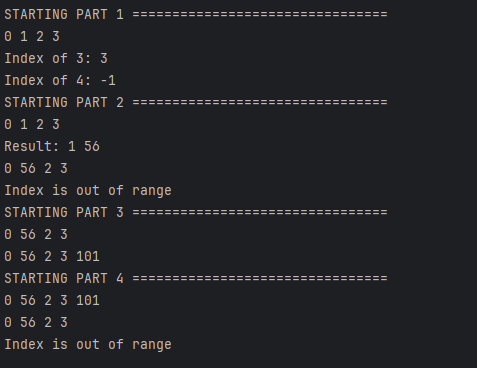

The code is already written to display the functionality of the vector, just run the driver in whatever IDE that you use.

As a side note, I was unable to get this code to work within the cpp file. It was not registering my header file, for
some reason, so that is why all the code is within the header file.

Here is a screenshot of the expected results::
